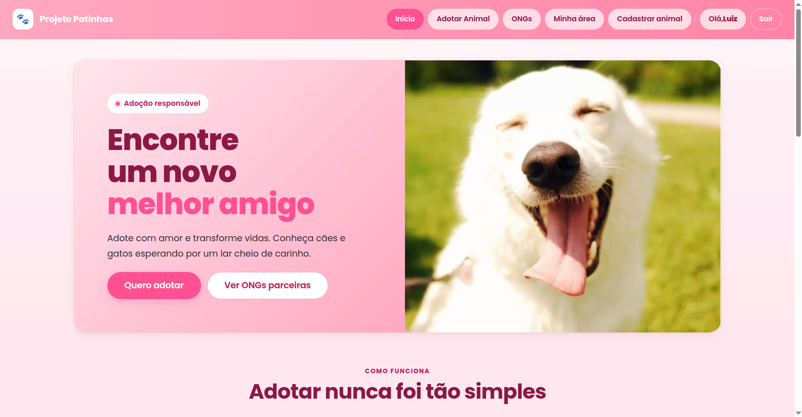
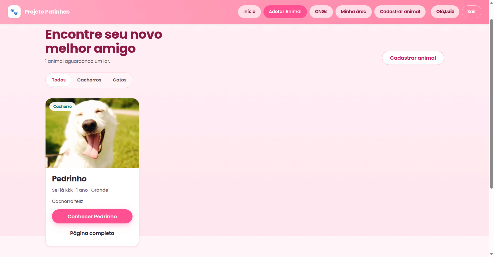
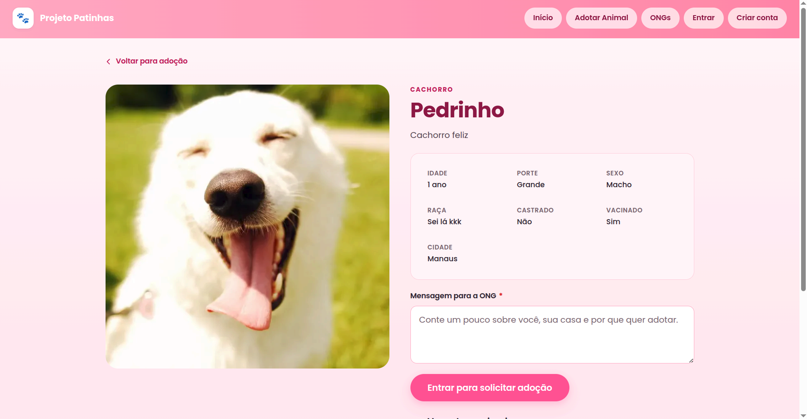
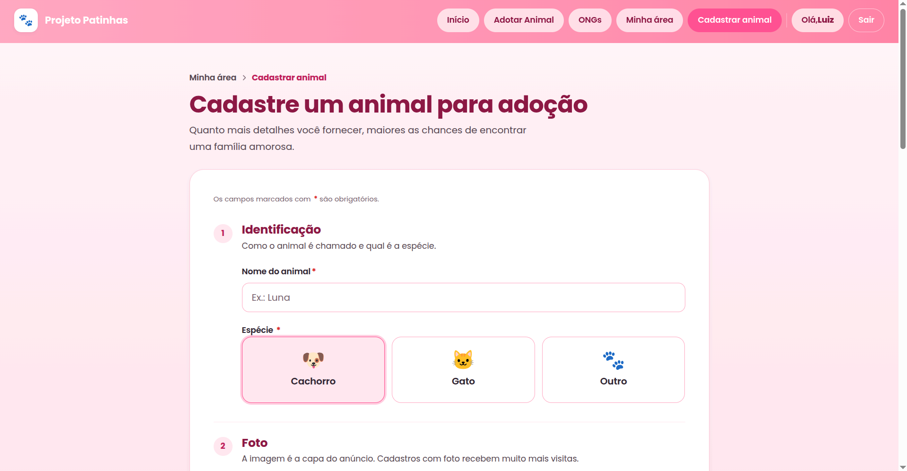
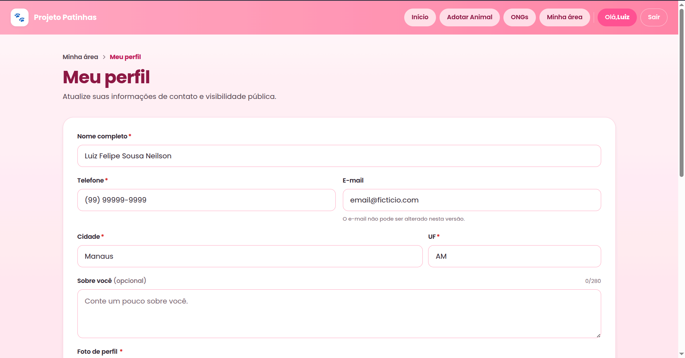

<div align="center">

# 🐾 Projeto Patinhas

**Adoção responsável de cães e gatos — uma plataforma feita para conectar quem resgata a quem quer um novo melhor amigo.**

[](https://nodejs.org/)
[](https://react.dev/)
[](https://vitejs.dev/)
[](https://expressjs.com/)
[](https://www.mysql.com/)
[](#-licença)

</div>

---


## Sobre o projeto

**Projeto Patinhas** é uma plataforma web para divulgar e organizar adoções de animais por ONGs e protetores independentes.
O objetivo é simples: **reduzir o atrito entre quem cuida e quem quer adotar**, oferecendo uma experiência clara para publicar animais, receber pedidos de adoção e acompanhar todo o ciclo até o "tá em casa!".

A interface preserva uma identidade calorosa — paleta rosa, tipografia acolhedora, copy humana em pt-BR — sem abrir mão de boas práticas modernas de UX, performance e acessibilidade.

> Cada cadastro é uma chance de mudar uma vida. A gente só tentou tornar esse caminho um pouco mais bonito.

---


## Funcionalidades

### Autenticação e contas
- Cadastro e login com validação completa
- Sessão com **access token (JWT) + refresh token em cookie HttpOnly**
- Rotação de refresh a cada renovação
- Soft delete de conta com revogação de sessões
- Papéis: `adotante`, `ong`, `admin`

### Animais
- CRUD completo de animais (apenas ONG/admin pode cadastrar)
- Filtros por espécie, porte e cidade
- Página de detalhe com foto principal otimizada
- Marcar como adotado / reabrir publicação

### Adoções
- Adotantes enviam mensagem para a ONG
- Máquina de estados: `pendente → aprovada | rejeitada → concluida | cancelada`
- ONGs aprovam, recusam ou concluem solicitações recebidas
- Adotantes acompanham o status das próprias solicitações

### Perfil
- Edição de perfil com **diff visual antes de salvar** (modal de confirmação)
- Indicador de "alterações não salvas" + aviso ao fechar a aba
- Upload de foto de perfil
- Zona de perigo para exclusão de conta

### Sistema de uploads (produção-grade)
- Drag-and-drop, preview ao vivo, barra de progresso e cancelamento
- Detecção de MIME por **magic bytes** (não confia em headers)
- Pipeline com **sharp**: rotação por EXIF, strip de metadata, 3 variantes WebP responsivas (200w / 600w / 1280w)
- Nomes de arquivo content-hashed (SHA-256) → cache imutável amigável a CDN
- Limite de tamanho e de dimensões com defesa anti-bomb

### ONGs
- Cadastro de organização vinculado ao usuário
- Listagem pública de ONGs parceiras

### Experiência
- Design responsivo (mobile → tablet → desktop)
- Acessibilidade: foco visível, `aria-*` consistente, `prefers-reduced-motion`, focus trap em modais
- Loading states reais, retry de uploads, breadcrumbs navegáveis
- Banner de feedback unificado para sucesso / erro / info

---


## Stack técnica

### Frontend
| Tecnologia | Uso |
|---|---|
| **React 19** | Biblioteca de UI |
| **Vite 8** | Bundler e dev server |
| **React Router 7** | Roteamento client-side |
| **React Hook Form 7** | Gerenciamento de formulários |
| **Zod 4** | Validação compartilhada com o backend |
| **Axios** | Cliente HTTP com interceptors e single-flight refresh |
| **React Icons** | Ícones (Font Awesome 6) |
| **CSS puro + tokens** | Design system com variáveis (cores, espaços, tipografia) |

### Backend
| Tecnologia | Uso |
|---|---|
| **Node.js 18+** | Runtime |
| **Express 4** | Framework HTTP |
| **MySQL 8 / 9** (mysql2) | Banco relacional |
| **Zod** | Validação de bodies, params e queries |
| **jsonwebtoken** | Geração e verificação de JWT |
| **bcryptjs** | Hash de senha |
| **multer** | Upload multipart em memória |
| **sharp** | Pipeline de imagem (resize + WebP + EXIF strip) |
| **helmet** | Headers de segurança |
| **express-rate-limit** | Rate limiting (global, auth, uploads) |
| **cookie-parser** | Cookie HttpOnly do refresh token |
| **pino / pino-http** | Logs estruturados |

### Banco de dados
- **MySQL** (testado em 8.x e 9.x)
- Migrações versionadas em `.sql` cru, executadas por runner próprio

---


## Estrutura de pastas

```
projPatinhas/
├── backend/
│   ├── app/
│   │   ├── config/           # env.js (parseado com Zod, fail-fast)
│   │   ├── controllers/      # auth, animal, usuario, ong, adocao, upload
│   │   ├── database/         # connection (pool mysql2)
│   │   ├── errors/           # AppError + subclasses
│   │   ├── middlewares/      # auth, validate, rateLimit, uploadMiddleware, errorHandler
│   │   ├── models/           # acesso a tabelas (animal, usuario, upload, …)
│   │   ├── routes/           # /api/auth, /api/animais, /api/uploads, …
│   │   ├── schemas/          # Zod por entidade
│   │   ├── services/         # regras de negócio (authService, uploadService, …)
│   │   ├── storage/          # StorageDriver + LocalDriver (S3/R2 plugáveis)
│   │   └── utils/            # mimeSniff, tokens, senha, variantesImagem, …
│   ├── db/
│   │   ├── migrations/       # 0001_init.sql, 0002_uploads.sql, 0003_validacoes.sql
│   │   └── run-migrations.js # runner com ledger schema_migrations
│   ├── uploads/              # arquivos servidos por express.static (gitignored)
│   ├── app.js                # bootstrap do Express
│   └── package.json
│
├── frontend/
│   ├── src/
│   │   ├── components/       # Banner, Modal, ConfirmDialog, ConfirmSaveDialog,
│   │   │                     # UploadFoto, Imagem, PageHeader, Navbar, Footer, …
│   │   ├── contexts/         # AuthContext + useAuth
│   │   ├── css/              # estilos por página
│   │   ├── hooks/            # useUnsavedWarning, …
│   │   ├── pages/            # Home, AdotarAnimal, AnimalDetalhe, Cadastro,
│   │   │                     # MinhaArea, Perfil, Login, Registro, …
│   │   ├── services/         # http (axios), authApi, animaisApi, uploadsApi, …
│   │   ├── App.jsx           # rotas
│   │   ├── main.jsx          # entry
│   │   └── index.css         # design tokens globais
│   ├── public/
│   ├── index.html
│   ├── vite.config.js        # proxy /api e /uploads → backend
│   └── package.json
│
└── README.md
```

---


## Pré-requisitos

Antes de começar, instale na sua máquina:

| Ferramenta | Versão recomendada | Verificar |
|---|---|---|
| **Node.js** | 18 LTS ou superior | `node -v` |
| **npm** | 9+ (vem com Node) | `npm -v` |
| **MySQL** | 8.x ou 9.x | `mysql --version` |
| **Git** | qualquer recente | `git --version` |

> **macOS / Linux**: você provavelmente vai conseguir instalar tudo via `brew` (mac) ou o gerenciador de pacotes da sua distro.
> **Windows**: recomendamos rodar via **WSL2** para evitar dores de cabeça com `sharp` e `mysql2`, mas funciona nativamente também.

---


## Instalação

### 1. Clone o repositório

```bash
git clone https://github.com/<seu-usuario>/projeto-patinhas.git
cd projeto-patinhas
```

### 2. Instale as dependências dos dois apps

```bash
# Backend
cd backend
npm install

# Frontend
cd ../frontend
npm install
```

> O `sharp` pode levar um pouco mais na primeira instalação porque baixa binários da plataforma — é normal.

---


## Banco de dados

### 1. Crie o database

Acesse o MySQL e crie um schema vazio com encoding correto:

```sql
CREATE DATABASE patinhas
  CHARACTER SET utf8mb4
  COLLATE utf8mb4_unicode_ci;
```

(Você pode escolher outro nome; só lembre de refletir em `DB_NAME` no `.env`.)

### 2. Configure o `.env` do backend

```bash
cd backend
cp .env.example .env
```

Edite o arquivo `.env` com seus dados reais (veja a [próxima seção](#-variáveis-de-ambiente)).

### 3. Rode as migrações

```bash
npm run db:migrate
```

Saída esperada:

```
→ 0001_init.sql ... OK
→ 0002_uploads.sql ... OK
→ 0003_validacoes.sql ... OK

3 migração(ões) aplicada(s) com sucesso.
```

O runner mantém um ledger em `schema_migrations` e nunca aplica a mesma migração duas vezes.

---


## Variáveis de ambiente

Todas as variáveis ficam em `backend/.env`. O frontend não usa `.env` — em dev, o Vite faz proxy para `/api` e `/uploads`.

### API

| Variável | Obrigatório | Default | Descrição |
|---|---|---|---|
| `NODE_ENV` | não | `development` | `development`, `test` ou `production` |
| `PORT` | não | `3000` | Porta HTTP do backend |
| `CORS_ORIGINS` | não | `http://localhost:5173,http://127.0.0.1:5173` | Lista separada por vírgula, sem espaços |

### Banco de dados (MySQL)

| Variável | Obrigatório | Exemplo |
|---|---|---|
| `DB_HOST` | sim | `localhost` |
| `DB_PORT` | não | `3306` |
| `DB_USER` | sim | `usuario_banco` |
| `DB_PASSWORD` | sim | *(sua senha)* |
| `DB_NAME` | sim | `patinhas` |

### Autenticação (JWT + cookies)

| Variável | Obrigatório | Notas |
|---|---|---|
| `JWT_ACCESS_SECRET` | sim | 16+ chars em dev, **32+ em prod**. Gere com `openssl rand -hex 48` |
| `JWT_REFRESH_SECRET` | sim | Idem, e **diferente** do access secret |
| `JWT_ACCESS_TTL` | não (`15m`) | Curto. Aceita formato do `ms` (ex.: `15m`, `1h`) |
| `JWT_REFRESH_TTL_DIAS` | não (`30`) | Em dias |
| `COOKIE_NOME_REFRESH` | não (`patinhas_rt`) | Nome do cookie HttpOnly |
| `COOKIE_SECURE` | não (`false`) | **Deve ser `true` em produção (HTTPS)** |
| `COOKIE_SAMESITE` | não (`lax`) | `lax`, `strict` ou `none` |
| `BCRYPT_ROUNDS` | não (`12`) | 10 dev / 12 prod |

### Uploads

| Variável | Obrigatório | Default | Descrição |
|---|---|---|---|
| `UPLOADS_DRIVER` | não | `local` | Hoje só `local`. Espaço para `s3`/`r2` |
| `UPLOADS_DIR` | não | `./uploads` | Pasta no disco. Criada automaticamente |
| `UPLOADS_PUBLIC_PATH` | não | `/uploads` | Prefixo público (`express.static`) |
| `UPLOADS_BASE_URL` | não | *(vazio)* | Preencha para servir via CDN — vira URL absoluta |
| `UPLOADS_MAX_BYTES` | não | `5242880` | 5 MiB. Espelhado no frontend |

> **Nunca** comite seu `.env`. O `.gitignore` já bloqueia, mas vale o lembrete.

---


## Como rodar

Você vai precisar de **dois terminais** em paralelo (backend + frontend).

### Backend — `:3000`

```bash
cd backend
npm run dev        # nodemon, reinicia ao salvar
# ou
npm start          # node app.js
```

Logs do startup:

```
API Patinhas escutando na porta 3000 (development)
```

### Frontend — `:5173`

```bash
cd frontend
npm run dev
```

Abre em `http://localhost:5173`. O Vite faz proxy automático de `/api` e `/uploads` para `http://localhost:3000`, então não precisa de CORS nem de URL absoluta em dev.

### Build de produção

```bash
cd frontend
npm run build     # gera dist/
npm run preview   # serve dist/ localmente para inspeção
```

O bundle final lazy-loada cada página de rota — o initial load fica baixo.

### Lint

```bash
cd frontend
npm run lint
```

---


## 🌐 Endpoints da API

Todas as rotas vivem sob `/api`. Respostas seguem o envelope padrão:

```json
// sucesso
{ "dados": { ... } }

// listas paginadas
{ "dados": [ ... ], "meta": { "pagina": 1, "limite": 20, "total": 42 } }

// erro
{ "erro": { "codigo": "VALIDACAO", "mensagem": "...", "detalhes": { ... } } }
```

| Método | Rota | Auth | Descrição |
|---|---|---|---|
| `POST` | `/api/auth/registrar` | — | Cria conta + sessão |
| `POST` | `/api/auth/login` | — | Login |
| `POST` | `/api/auth/refresh` | cookie | Rotaciona o refresh |
| `POST` | `/api/auth/logout` | cookie | Revoga o refresh atual |
| `GET`  | `/api/auth/eu` | bearer | Usuário autenticado |
| `GET`  | `/api/usuarios/:id` | — | Perfil público |
| `PUT`  | `/api/usuarios/:id` | bearer | Atualiza próprio perfil |
| `DELETE` | `/api/usuarios/:id` | bearer | Soft delete da conta |
| `GET`  | `/api/animais` | — | Lista de disponíveis (filtros por query) |
| `GET`  | `/api/animais/:id` | — | Detalhe de animal |
| `POST` | `/api/animais` | bearer (ong/admin) | Cadastra animal |
| `PUT`  | `/api/animais/:id` | bearer (dono/admin) | Atualiza animal |
| `DELETE` | `/api/animais/:id` | bearer (dono/admin) | Soft delete |
| `GET`  | `/api/ongs` | — | Lista de ONGs |
| `POST` | `/api/ongs` | bearer | Cria ONG (promove papel) |
| `POST` | `/api/adocoes` | bearer | Solicita adoção |
| `GET`  | `/api/adocoes/minhas` | bearer | Minhas solicitações |
| `GET`  | `/api/adocoes/recebidas` | bearer (ong) | Solicitações recebidas |
| `PATCH`| `/api/adocoes/:id` | bearer | Aprovar/recusar/concluir/cancelar |
| `POST` | `/api/uploads` | bearer | Upload de imagem (`multipart/form-data`) |
| `GET`  | `/api/uploads/:id` | — | Metadados do upload |
| `DELETE` | `/api/uploads/:id` | bearer (dono/admin) | Remove |

---


## Sistema de uploads

O fluxo de imagem foi pensado como **defesa em profundidade**:

```
cliente → multer (limite + filtro MIME) →
  → magic-byte sniff (verifica os primeiros bytes do arquivo) →
    → sharp pipeline (metadata + EXIF strip + resize + WebP) →
      → storage driver (local hoje, S3/R2 depois) →
        → registro em `uploads` com SHA-256 do conteúdo
```

### Variantes geradas

| Chave | Largura | Uso típico | Formato |
|---|---|---|---|
| `original` | original | fallback | formato enviado |
| `otimizado` | 1280 px | herói / detalhe | WebP q=82 |
| `card` | 600 px | grades de cards | WebP q=78 |
| `thumb` | 200 px | avatares / listas densas | WebP q=72 |

### Headers de cache e segurança

Como o nome do arquivo é o **hash SHA-256 do conteúdo**, o byte servido nunca muda para uma mesma URL:

```
Cache-Control: public, max-age=31536000, immutable
Cross-Origin-Resource-Policy: cross-origin
X-Content-Type-Options: nosniff
X-Frame-Options: DENY
```

Apenas `GET` e `HEAD` são permitidos no prefixo `/uploads` — qualquer outro método recebe `405`.

### Formatos aceitos

JPEG, PNG e WebP, até **5 MiB**. Dimensões mínimas 50×50 px e razão de aspecto até 20:1.
O frontend faz validação **espelhada** para feedback rápido, mas o backend nunca confia no cliente.

---


## Autenticação

```
┌─────────────┐  login    ┌─────────────┐
│  Frontend   │ ────────► │   Backend   │
└─────────────┘           └─────────────┘
        │                        │
        │  access token (memória)│
        │ ◄──────────────────────│
        │  refresh token (HttpOnly cookie)
        │ ◄──────────────────────│
        │                        │
        │  Authorization: Bearer <access>
        │ ──────────────────────►│
        │                        │
        │  401 → /auth/refresh   │
        │ ──────────────────────►│
        │  novo access + rotação │
        │ ◄──────────────────────│
```

- **Access token** (JWT, 15 min): só em memória do JS. Nunca em `localStorage` (evita roubo via XSS).
- **Refresh token** (opaco, 30 dias): `HttpOnly` + `SameSite` + `Secure` em prod. Apenas o SHA-256 fica no banco.
- **Rotação**: cada `/auth/refresh` revoga o token usado e emite um novo par.
- **Single-flight**: 401 simultâneos disparam **um único** refresh; as outras requisições aguardam.

Rotas protegidas usam o middleware `exigirAuth`. Papéis (`adotante`, `ong`, `admin`) gateiam ações específicas via `exigirPapel`.

---


## Responsividade e acessibilidade

- **Mobile first** com breakpoints a partir de 480 / 560 / 720 / 880 px
- Containers em `clamp()`, sem larguras fixas
- Touch targets ≥ 44 px (botões, chips, inputs, cards de seleção)
- `prefers-reduced-motion: reduce` honrado (sem hover lifts, transições mínimas)
- Foco visível em **todos** os controles via `--shadow-focus`
- `aria-invalid`, `aria-required`, `aria-busy`, `aria-current`, `aria-labelledby` aplicados consistentemente
- Modais com focus trap, ESC para fechar, devolução de foco ao elemento que abriu
- Breadcrumb semântico (`<nav><ol>`) com `aria-current="page"`
- Skip-to-content no topo da página

---


## Práticas de segurança

| Camada | O que fazemos |
|---|---|
| **Validação** | Zod em **todas** as rotas (body, params, query). Frontend valida espelhado para UX. |
| **Senhas** | bcrypt com cost configurável (12 default). Hash nunca sai por nenhuma resposta. |
| **Tokens** | Access em memória; refresh em cookie HttpOnly + SHA-256 no DB; rotação a cada uso. |
| **Uploads** | Magic-byte sniff + sharp metadata + cap de pixels + ratio guard + rate limit dedicado. |
| **Headers HTTP** | `helmet()` global; nos arquivos estáticos: nosniff, `X-Frame-Options: DENY`, CORP, Cache-Control immutable. |
| **CORS** | Origens whitelisted por env, credentials apenas para a lista. |
| **SQL** | Sempre via `?` placeholders do mysql2. Zero string concat. |
| **Soft delete** | `deletado_em` em usuários e animais; refresh tokens revogados em cascata. |
| **Logs** | pino-http com redact de `Authorization`, `Cookie`, `senha`. |
| **Rate limit** | Global (120/min), auth (20/10min), uploads (30/10min por usuário). |

---


## Screenshots / Preview


```
docs/screenshots/
├── home.png
├── adotar.png
├── animal-detalhe.png
├── cadastro-animal.png
├── perfil.png
└── solicitacoes-recebidas.png
```


<p align="center">
  
</p>
<p align="center">
  
</p>
<p align="center">
  
</p>
<p align="center">
  
</p>
<p align="center">
  
</p>

---


## Contribuindo

Pull requests são muito bem-vindos! Para mudanças grandes, abra uma issue primeiro para conversarmos.

### Fluxo sugerido

1. **Fork** o repositório
2. Crie uma branch a partir de `master`:
   ```bash
   git checkout -b feat/minha-feature
   # ou
   git checkout -b fix/corrige-bug-x
   ```
3. **Comite** seguindo nomes claros (`feat: …`, `fix: …`, `refactor: …`, `docs: …`)
4. Antes do PR:
   ```bash
   cd frontend && npm run lint && npm run build
   ```
5. Abra o **Pull Request** descrevendo:
   - O que mudou
   - Por quê
   - Como testar (passo a passo)

### Padrões de código

- **PT-BR** em identificadores, comentários e mensagens — é a língua do projeto
- Não introduza camadas de abstração além do necessário
- Validação **sempre** server-side. Frontend é espelho, não fonte de verdade
- Acessibilidade não é opcional — `aria-*`, foco, contraste, redução de movimento
- Tokens de design existentes (`--color-pink-*`, `--space-*`, `--radius-*`) antes de valores literais

---


## Licença

Distribuído sob a **Licença MIT** — veja o arquivo [`LICENSE`](./LICENSE) para detalhes.

```
MIT License

Copyright (c) 2026 Projeto Patinhas

Permission is hereby granted, free of charge, to any person obtaining a copy
of this software and associated documentation files (the "Software"), to deal
in the Software without restriction, including without limitation the rights
to use, copy, modify, merge, publish, distribute, sublicense, and/or sell
copies of the Software, and to permit persons to whom the Software is
furnished to do so, subject to the following conditions:

The above copyright notice and this permission notice shall be included in all
copies or substantial portions of the Software.

THE SOFTWARE IS PROVIDED "AS IS", WITHOUT WARRANTY OF ANY KIND, EXPRESS OR
IMPLIED, INCLUDING BUT NOT LIMITED TO THE WARRANTIES OF MERCHANTABILITY,
FITNESS FOR A PARTICULAR PURPOSE AND NONINFRINGEMENT. IN NO EVENT SHALL THE
AUTHORS OR COPYRIGHT HOLDERS BE LIABLE FOR ANY CLAIM, DAMAGES OR OTHER
LIABILITY, WHETHER IN AN ACTION OF CONTRACT, TORT OR OTHERWISE, ARISING FROM,
OUT OF OR IN CONNECTION WITH THE SOFTWARE OR THE USE OR OTHER DEALINGS IN THE
SOFTWARE.
```

---

<div align="center">

**Feito com 🐾 para quem acredita que toda patinha merece um lar.**

</div>
